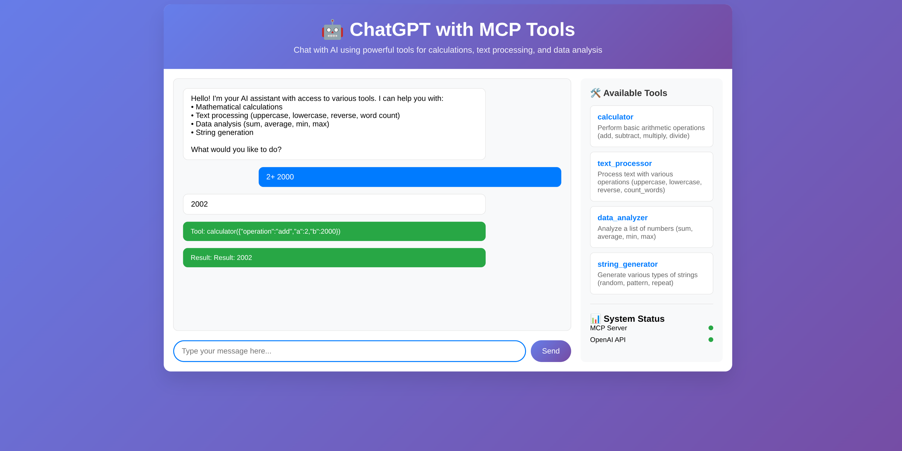

# ChatGPT with MCP Tools

A FastAPI application that integrates ChatGPT with Model Context Protocol (MCP) tools for enhanced AI capabilities. This project demonstrates how to create an MCP server with trivial methods and expose them through a FastAPI wrapper, then use them with ChatGPT's tool calling feature.

## 🖼️ Web Interface Example



*Above: The included `index.html` web interface in action (see `static/index.html`).*

## 🚀 Features

- **MCP Server**: Custom server with trivial tools for calculations, text processing, data analysis, and string generation
- **FastAPI Wrapper**: HTTP API wrapper around the MCP server
- **ChatGPT Integration**: Full integration with OpenAI's GPT-4 model and tool calling
- **Web Interface**: Beautiful, responsive web UI for testing the application
- **Real-time Status**: Health monitoring for all services

## 🛠️ Available Tools

### Calculator
- **Operations**: add, subtract, multiply, divide
- **Example**: "Calculate 15 + 27"

### Text Processor
- **Operations**: uppercase, lowercase, reverse, count_words
- **Example**: "Convert 'hello world' to uppercase"

### Data Analyzer
- **Operations**: sum, average, min, max
- **Example**: "Find the average of [10, 20, 30, 40, 50]"

### String Generator
- **Operations**: random, pattern, repeat
- **Example**: "Generate a random string of length 10"

## 📋 Prerequisites

- Python 3.8+
- OpenAI API key
- Internet connection

## 🛠️ Installation

1. **Clone or download the project files**

2. **Install dependencies**:
   ```bash
   pip install -r requirements.txt
   ```

3. **Set up your OpenAI API key**:
   ```bash
   export OPENAI_API_KEY="your-api-key-here"
   ```
   
   Or create a `.env` file:
   ```
   OPENAI_API_KEY=your-api-key-here
   ```

## 🚀 Running the Application

### Option 1: Use the startup script (Recommended)
```bash
python start.py
```

This will start both the MCP wrapper (port 8000) and the main application (port 8001).

### Option 2: Run services individually

1. **Start the MCP FastAPI wrapper**:
   ```bash
   python mcp_fastapi_wrapper.py
   ```

2. **In another terminal, start the main application**:
   ```bash
   python main.py
   ```

## 🌐 Accessing the Application

Once running, you can access:

- **Web Interface**: http://localhost:8001
- **API Documentation**: http://localhost:8001/docs
- **MCP API**: http://localhost:8000
- **Health Check**: http://localhost:8001/health

## 📚 API Usage

### Chat with Tools
```bash
curl -X POST "http://localhost:8001/chat" \
  -H "Content-Type: application/json" \
  -d '{
    "message": "Calculate 15 + 27 for me",
    "conversation_history": []
  }' | python -m json.tool
```
**Expected response:**
```json
{
    "response": "The result is 42.",
    "tool_calls": [
        {
            "name": "calculator",
            "arguments": {
                "operation": "add",
                "a": 15,
                "b": 27
            }
        }
    ],
    "tool_results": [
        "Result: 42"
    ]
}
```

### List Available Tools
```bash
curl "http://localhost:8001/tools"
```

### Simple Chat (without tools)
```bash
curl -X POST "http://localhost:8001/chat/simple" \
  -H "Content-Type: application/json" \
  -d '{
    "message": "Hello, how are you?",
    "conversation_history": []
  }'
```

## 🧪 Testing Examples

Try these example conversations in the web interface:

1. **Mathematical calculations**:
   - "What is 25 * 13?"
   - "Calculate the sum of 10, 20, 30, 40, and 50"

2. **Text processing**:
   - "Convert 'Hello World' to uppercase"
   - "Reverse the text 'OpenAI'"
   - "Count the words in 'This is a test sentence'"

3. **Data analysis**:
   - "Find the average of [1, 2, 3, 4, 5]"
   - "What's the maximum value in [10, 5, 25, 15, 30]?"

4. **String generation**:
   - "Generate a random string of length 8"
   - "Create a pattern string of length 12 with pattern 'abc'"

## 🏗️ Architecture

```
┌────────────────────┐
│  Web Interface     │
│  (static HTML/JS)  │
└─────────┬──────────┘
          │ HTTP (REST)
          ▼
┌────────────────────────────┐
│   Main FastAPI App (8001)  │
│  (LLM + Tool Orchestration)│
└─────────┬──────────┬───────┘
          │          │
          │          │
          ▼          ▼
   OpenAI API   MCP FastAPI Wrapper (8000)
    (ChatGPT)   │
                ▼
         MCP Server (Python class)
```

- The **Web Interface** (browser) communicates only with the **Main FastAPI App** (port 8001).
- The **Main FastAPI App** orchestrates LLM calls and tool calls.
- The **MCP FastAPI Wrapper** (port 8000) and **MCP Server** are in the same process/module; the wrapper directly calls the MCP server Python class.
- The **Main FastAPI App** also communicates with the **OpenAI API** for LLM completions.

## 📁 Project Structure

```
.
├── mcp_server.py              # MCP server with trivial tools
├── mcp_fastapi_wrapper.py     # FastAPI wrapper for MCP server
├── main.py                    # Main ChatGPT application
├── start.py                   # Startup script
├── requirements.txt           # Python dependencies
├── static/
│   └── index.html            # Web interface
└── README.md                 # This file
```

## 🔧 Customization

### Adding New Tools

To add new tools to the MCP server:

1. **Add tool definition** in `mcp_server.py`:
   ```python
   Tool(
       name="your_tool_name",
       description="Description of your tool",
       inputSchema={
           "type": "object",
           "properties": {
               "param1": {"type": "string"},
               "param2": {"type": "number"}
           },
           "required": ["param1", "param2"]
       }
   )
   ```

2. **Add tool handler** in `mcp_server.py`:
   ```python
   async def your_tool_handler(args: Dict[str, Any]) -> CallToolResult:
       # Your tool logic here
       return CallToolResult(
           content=[TextContent(type="text", text="Your result")]
       )
   ```

3. **Register the tool** in the `handle_call_tool` function.

### Modifying the Web Interface

Edit `static/index.html` to customize the web interface appearance and functionality.

## 🐛 Troubleshooting

### Common Issues

1. **"MCP Server is not responding"**
   - Check if the MCP wrapper is running on port 8000
   - Restart the application using `python start.py`

2. **"OpenAI API not configured"**
   - Set the `OPENAI_API_KEY` environment variable
   - Ensure you have a valid OpenAI API key

3. **Port already in use**
   - Kill processes using ports 8000 and 8001
   - Or modify the port numbers in the respective files

4. **Import errors**
   - Install all dependencies: `pip install -r requirements.txt`
   - Ensure you're using Python 3.8+

### Debug Mode

To run with debug output, modify the uvicorn calls in the Python files:

```python
uvicorn.run(app, host="0.0.0.0", port=8001, log_level="debug")
```

## 📄 License

This project is open source and available under the MIT License.

## 🤝 Contributing

Feel free to submit issues, feature requests, or pull requests to improve this project.

## 📞 Support

If you encounter any issues or have questions, please check the troubleshooting section above or create an issue in the project repository. 